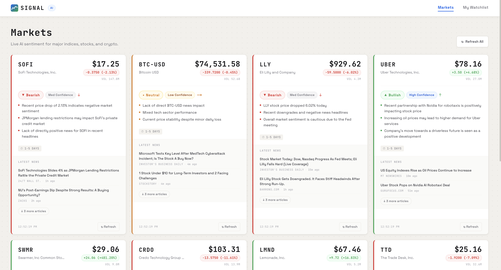

# Signal - Know the Mood of the Market Before It Moves

> AI-powered sentiment analysis for stocks, ETFs, indices, and crypto - built for anyone who wants a clear read on market direction without spending hours reading the news.

## The Story
Every day, thousands of headlines fight for your attention. Earnings beats, analyst downgrades, macro fears, hype cycles - the noise is relentless. Most people either ignore it entirely or get lost in it.

**Signal was built to cut through.**

Type in any ticker. In seconds, Signal pulls live price data and the latest news headlines, runs them through a large language model, and returns a single clear verdict: **Bullish, Bearish, or Neutral** - with bullet-point reasoning and a confidence level.

No subscriptions. No paywalls. No finance degree required. Just the signal.



## What It Does
- **Markets page** - a live dashboard of trending tickers auto-analyzed on load
- **My Watchlist** - add any stock, ETF, index, or crypto; your list is saved locally and persists between visits
- **AI Sentiment** - each card shows Bullish / Bearish / Neutral, confidence level, directional prediction (↑ ↓ →), and bullet-point reasoning
- **Live news** - latest headlines per ticker from Yahoo Finance, collapsed by default to keep cards compact
- **Search** - real-time autocomplete for stocks, ETFs, indices, and crypto

## Tech Stack
| Layer | Technology |
|---|---|
| Framework | [Next.js 16](https://nextjs.org) (App Router, Turbopack) |
| Language | TypeScript (strict mode) |
| AI | [Groq](https://groq.com) - `llama-3.3-70b-versatile` |
| Market data | Yahoo Finance (public endpoints) |
| Animations | [Framer Motion](https://www.framer.com/motion/) |
| Fonts | JetBrains Mono + Space Grotesk |
| Storage | `localStorage` - no database, no accounts |

## Getting Started
### Prerequisites

- Node.js 18+
- A free [Groq API key](https://console.groq.com/keys) - 1,000 req/day on the free tier

### Setup

```bash
# 1. Clone the repo
git clone https://github.com/your-username/signal.git
cd signal

# 2. Install dependencies
npm install

# 3. Add your API key
cp .env.example .env.local
# Open .env.local and set GROQ_API_KEY=your_key_here

# 4. Run locally
npm run dev
```

Open [http://localhost:3000](http://localhost:3000).

## Environment Variables
| Variable | Required | Description |
|---|---|---|
| `GROQ_API_KEY` | Yes | Your Groq API key - server-side only, never sent to the browser |

Copy `.env.example` to `.env.local` and fill in your key. **Never commit `.env.local`** - it is gitignored.

## Project Structure
```
src/
├── app/
│   ├── api/
│   │   ├── analyze/route.ts   # POST - fetches quote + news, runs Groq analysis
│   │   ├── search/route.ts    # GET  - ticker autocomplete via Yahoo Finance
│   │   └── tickers/route.ts   # GET  - dynamic trending tickers from Yahoo Finance
│   ├── watchlist/page.tsx     # My Watchlist page
│   ├── page.tsx               # Markets page
│   ├── layout.tsx             # Root layout, fonts, metadata
│   └── globals.css            # Design tokens + base styles
├── components/
│   ├── layout/                # Header, Footer
│   ├── search/                # TickerSearch (debounced autocomplete)
│   ├── shared/                # LoadingCard (skeleton)
│   └── watchlist/             # StockCard, WatchlistGrid, SentimentBadge, NewsItem, EmptyState
├── hooks/
│   ├── useMarkets.ts          # Fetches dynamic Markets ticker list
│   └── useWatchlist.ts        # User watchlist state + localStorage persistence
├── lib/
│   └── rateLimit.ts           # In-memory IP rate limiter for API routes
└── types/
    └── index.ts               # Shared TypeScript interfaces

config/
├── eslint.config.mjs
├── jest.config.ts
└── jest.setup.ts
```

## Security
| Concern | How it's handled |
|---|---|
| API key exposure | `GROQ_API_KEY` is only accessed in server-side API routes via `process.env`. Never referenced in client code, never prefixed `NEXT_PUBLIC_`. |
| Rate limiting | `/api/analyze` - 15 req/IP/min. `/api/search` - 60 req/IP/min. Protects Groq quota from abuse. |
| Input validation | Tickers are sanitized (trimmed, uppercased, max 20 chars) before reaching any external API. |
| User data | No database, no authentication, no analytics. Watchlist data lives only in the user's own browser `localStorage`. |
| External data | Only public Yahoo Finance endpoints are used - no PII in any request or response. |

## Deploying to Vercel
1. Push your repo to GitHub
2. Import it at [vercel.com/new](https://vercel.com/new)
3. Add `GROQ_API_KEY` under **Settings → Environment Variables**
4. Deploy

[](https://vercel.com/new)

> **Note on rate limiting:** The in-memory rate limiter resets on each serverless cold start. For high-traffic deployments, swap it for a Redis-backed store (e.g. [Upstash](https://upstash.com)).

## Scripts
```bash
npm run dev            # Start dev server (Turbopack)
npm run build          # Production build
npm run start          # Serve production build
npm run lint           # ESLint
npm run test           # Jest
npm run test:watch     # Jest watch mode
npm run test:coverage  # Coverage report
```

## Disclaimer
Signal is an informational tool only. Nothing on this site constitutes financial advice. AI-generated sentiment analysis can be wrong - and often is. Always do your own research before making any investment decisions.

## License
MIT - free to use, fork, and build on.
